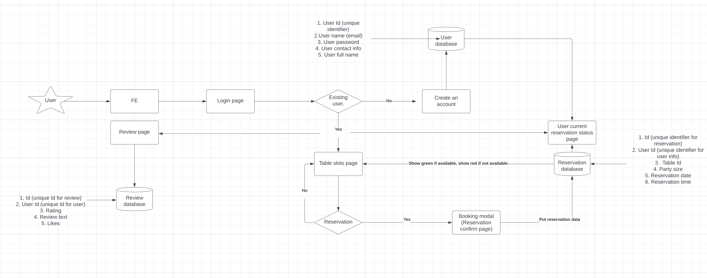
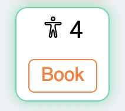

# Reservation web

Here is the link for the live page! [Live Page](https://restaurant-reservation-sw.netlify.app/).

## Languages

Built by using HTML, CSS, React, and mySql.

## Description

The purpose of this project was to practice MySQL.

Before we started the project, we made a diagram and decided in which direction to proceed how we are going to save our user data, reservation status, and reviews.

By filtering the tables that are currently reserved through the reservation database, a green border is used when a reservation is available, and a red border is used when it is not.
